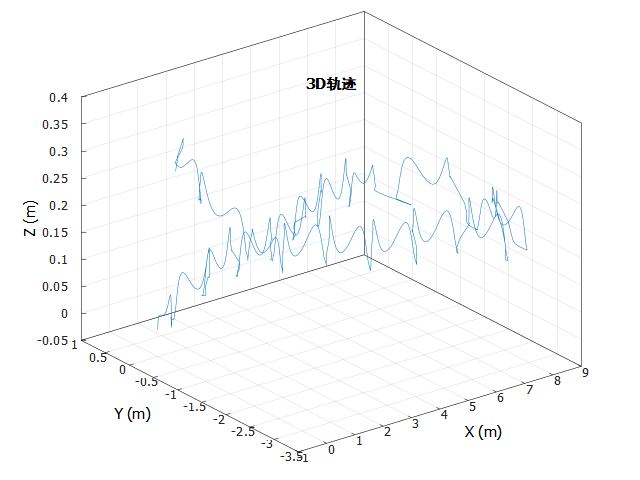
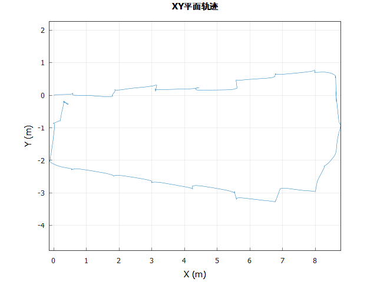

# 行人惯性导航零速度更新（IEZ-PDR）

## 算法
- 扩展卡尔曼滤波

## 结果

<div align="center">
  
  
</div>


## build

### 前置要求
- CMake 3.18
- C++17（MSVC、GCC、Clang）
- Eigen3

### 构建步骤

1. 创建构建目录：
```bash
mkdir build
cd build
```

2. 配置CMake：
```bash
cmake ..
```

3. 编译：
```bash
cmake --build .
```

4. 运行：
```bash
# Windows
.\bin\still_detection_zupt.exe

# Linux
./bin/still_detection_zupt
```

## 主要功能

- 静止检测（Still Detection）
- ZUPT（Zero Velocity Update）测试
